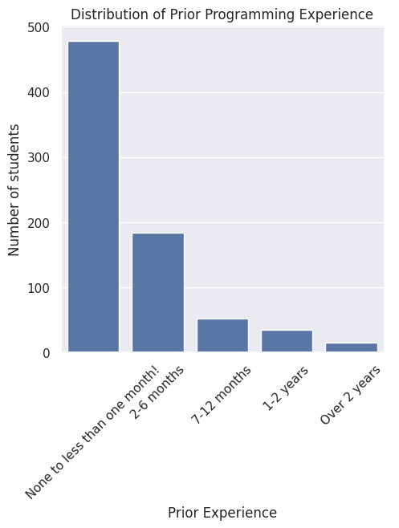
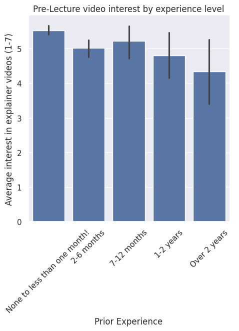
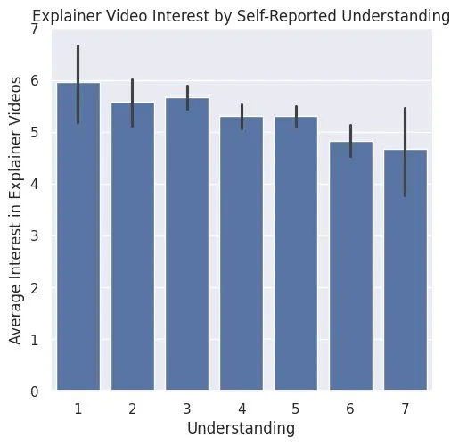

---
# Do not edit the text between these lines!
layout: default
---

# Rayane Fadel's Personal Website

<!-- This is a comment. Below, you'll see code for inserting an image. To make this image appear, update <custom-path>. To add an image, save it inside the imgs folder of this repository. -->

Hey! I'm Rayane, originally from Morocco 🇲🇦 so French is my first language. I'm a student at UNC Chapel Hill taking COMP110. Outside of class I love playing soccer (Hala Madrid ⚽), playing tennis, and watching movies (The Godfather is my all time favorite.)

## My COMP110 Data Project

For my EX09 project, I analyzed survey data from COMP110 students to explore whether adding short optional pre-lecture explainer videos would help students, especially beginners.

The data supports it! Students with less experience and lower self-reported understanding consistently wanted these videos more.

[Click here to see my full analysis](about)

## Final Takeaway

Overall, the data strongly suggests that adding short explainer videos would benefit a large portion of COMP110 students, especially beginners who are still building confidence.